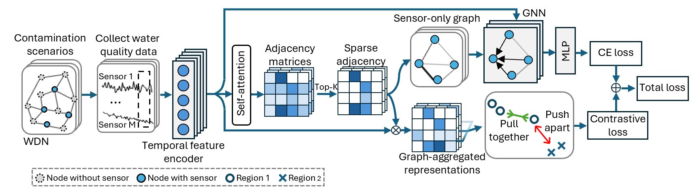
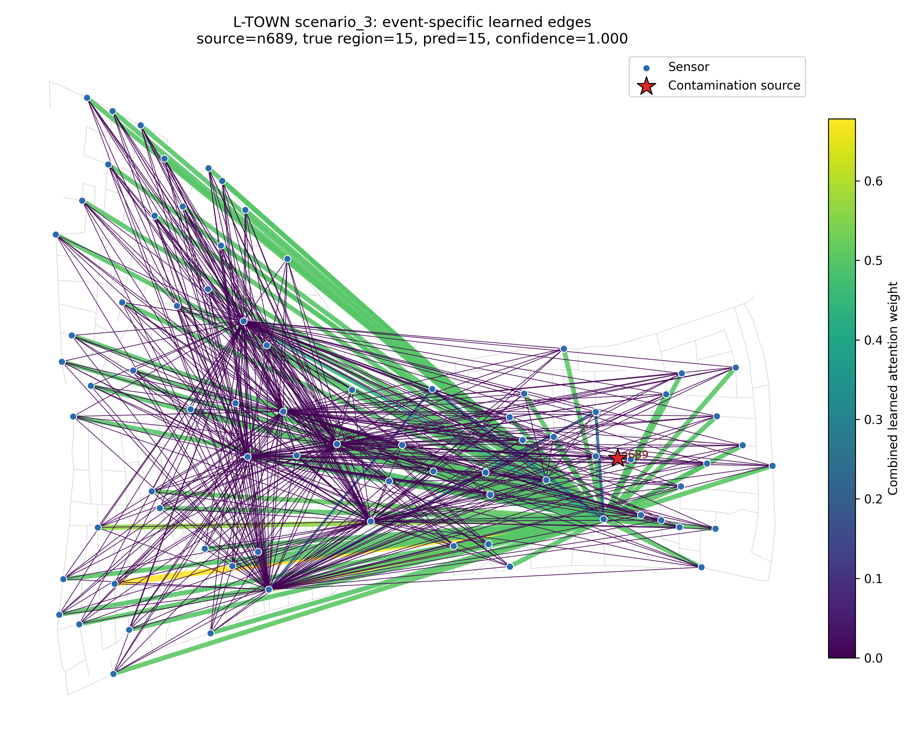

# SCGNN

Sensor-only Contrastive Graph Neural Network (SCGNN) for contamination source isolation in water distribution networks (WDN).



## Dataset

The contamination isolation scenarios are distributed through [Zenodo](https://zenodo.org/records/20462263):

> X. Chen, S. Vrachimisand M. Polycarpou, “Contamination Isolation Scenarios in Water Distribution Networks”. Zenodo, May 30, 2026. doi: 10.5281/zenodo.20462263.

After downloading the dataset, arrange it as:

```text
data/
  ZJ/
    sensors.txt
    scenario_*.mat
  L-TOWN/
    sensors.txt
    scenario_*.mat
```

The WDN input files and partition files used by the scripts are in `networks/`.

## Installation

Create an environment with Python 3.10+ and install the dependencies:

```bash
pip install -r requirements.txt
```

## Train SCGNN

Zhi Jiang:

```bash
python scgnn.py \
  --network ZJ \
  --data_dir data/ZJ
```

L-Town:

```bash
python scgnn.py \
  --network L-TOWN \
  --data_dir data/L-TOWN
```

Useful options include `--top_k`, `--contrastive_lambda`, `--contrastive_temp`, `--hidden_dim`, `--batch_size`, and `--device`.

## Performance

Performance comparison on contamination source isolation with accuracy and F1-score (mean +/- std.). Best results are in **bold**.

| Model | Zhi Jiang Acc. (%) | Zhi Jiang F1 (%) | L-TOWN Acc. (%) | L-TOWN F1 (%) |
|---|---:|---:|---:|---:|
| GAT | 77.07 +/- 2.55 | 77.72 +/- 2.93 | 76.00 +/- 1.68 | 76.86 +/- 2.04 |
| GGNN | 79.86 +/- 1.73 | 80.24 +/- 1.05 | 81.96 +/- 0.86 | 83.44 +/- 0.80 |
| IDGL | 79.84 +/- 1.18 | 80.23 +/- 1.20 | 82.38 +/- 0.44 | 83.26 +/- 0.91 |
| NodeFormer | 81.04 +/- 0.90 | 81.36 +/- 0.74 | 81.14 +/- 0.52 | 82.88 +/- 0.57 |
| PatchTST | 84.11 +/- 0.59 | 84.32 +/- 0.52 | 83.87 +/- 0.56 | 84.93 +/- 0.44 |
| CrossFormer | 83.70 +/- 0.64 | 83.47 +/- 0.68 | 79.50 +/- 1.50 | 80.25 +/- 0.93 |
| TimeXer | 84.22 +/- 0.53 | 84.37 +/- 0.52 | 78.27 +/- 2.25 | 79.38 +/- 2.11 |
| MedFormer | 83.46 +/- 1.23 | 83.59 +/- 1.22 | 80.76 +/- 3.74 | 82.02 +/- 3.78 |
| **SCGNN** | **86.71 +/- 0.66** | **86.75 +/- 0.75** | **86.28 +/- 0.37** | **87.53 +/- 0.27** |

## Visualize Event-Specific Learned Edges



## Citation

If you use this repository or dataset, please cite the dataset:

```bibtex
@dataset{chen_2026_contamination_isolation_scenarios,
  author       = {Chen, Xiaohan and Vrachimis, Stelios and Polycarpou, Marios},
  title        = {Contamination Isolation Scenarios in Water Distribution Networks},
  publisher    = {Zenodo},
  year         = {2026},
  month        = may,
  doi          = {10.5281/zenodo.20462263}
}
```
